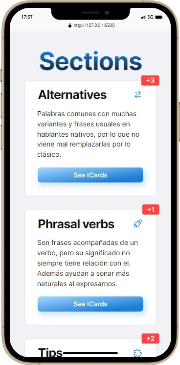
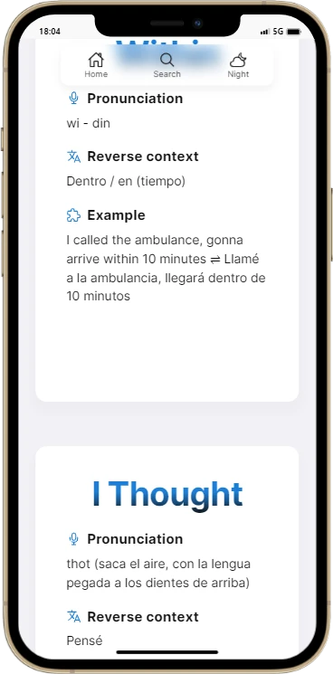
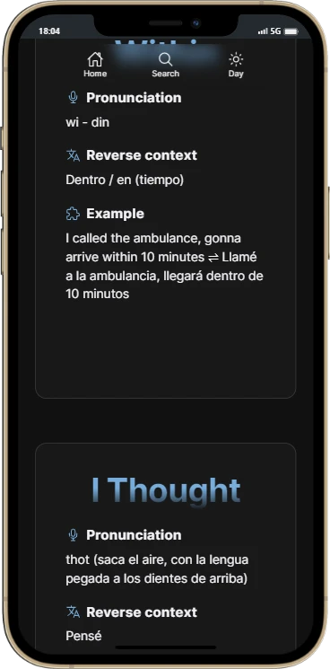
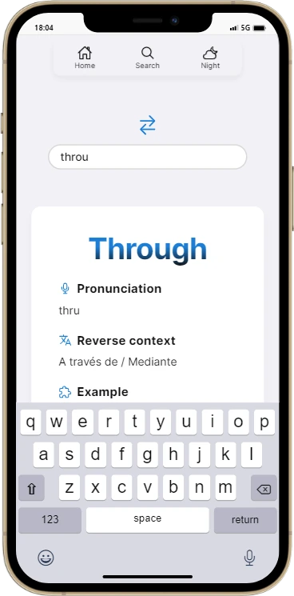

# Tolescro 🎴

This project help people, to improve their english vocabulary through simple and fun cards. Is divide in sections where the user can scroll and learn what they want.

<section style="display: flex; gap: 2rem; font-size: .7rem;" align="center">

	
Util sections

	

	
Complete and focus cards

	

	
The cards lives into the dark

	

	
Powerful search

	

</section>
